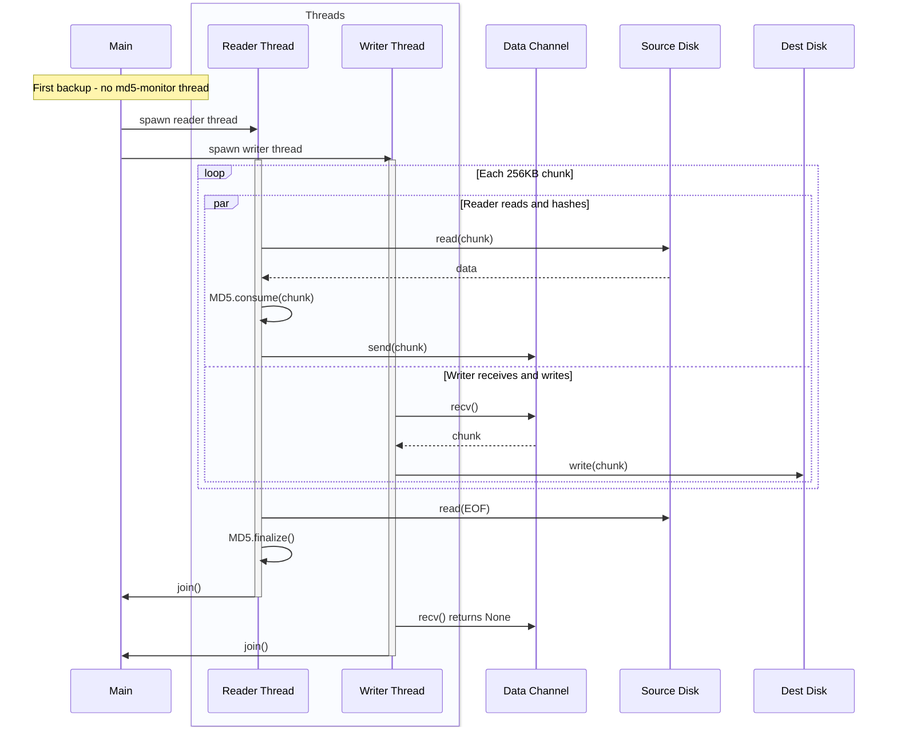
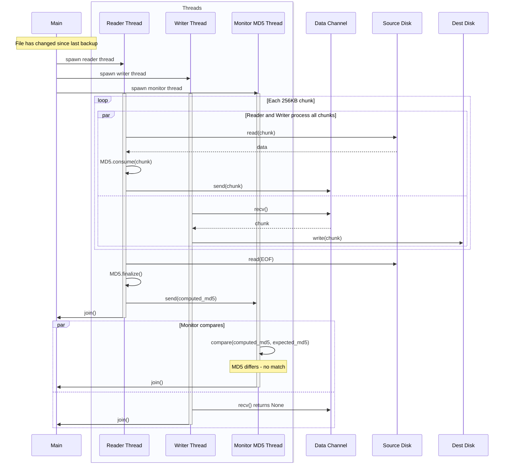
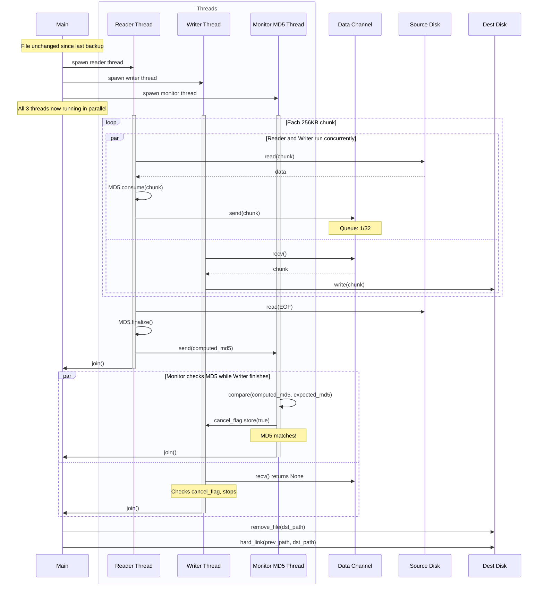
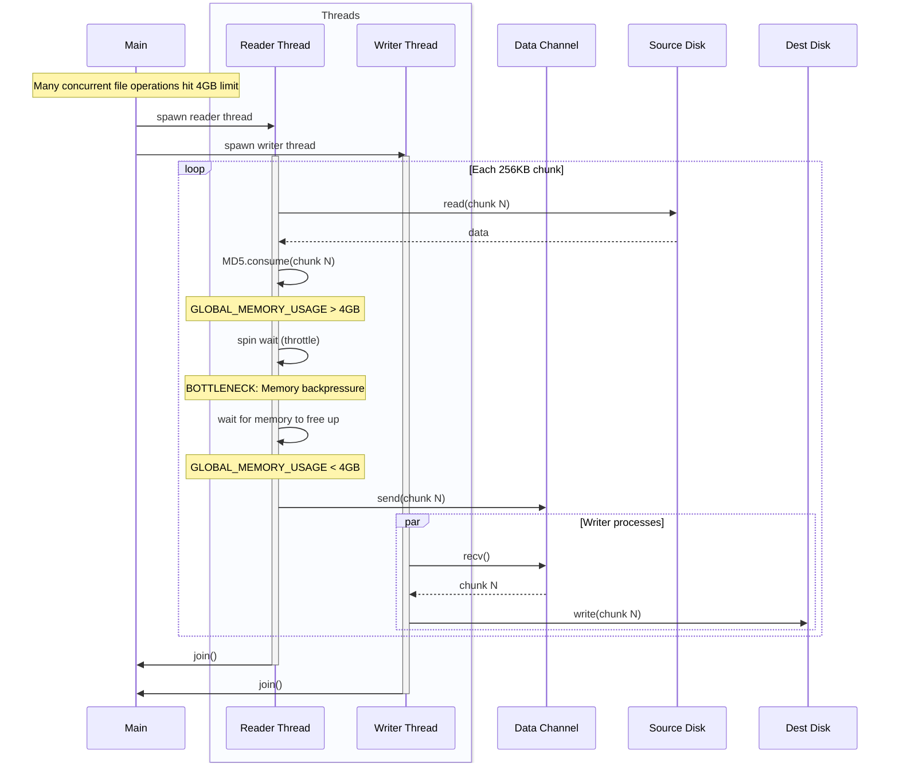
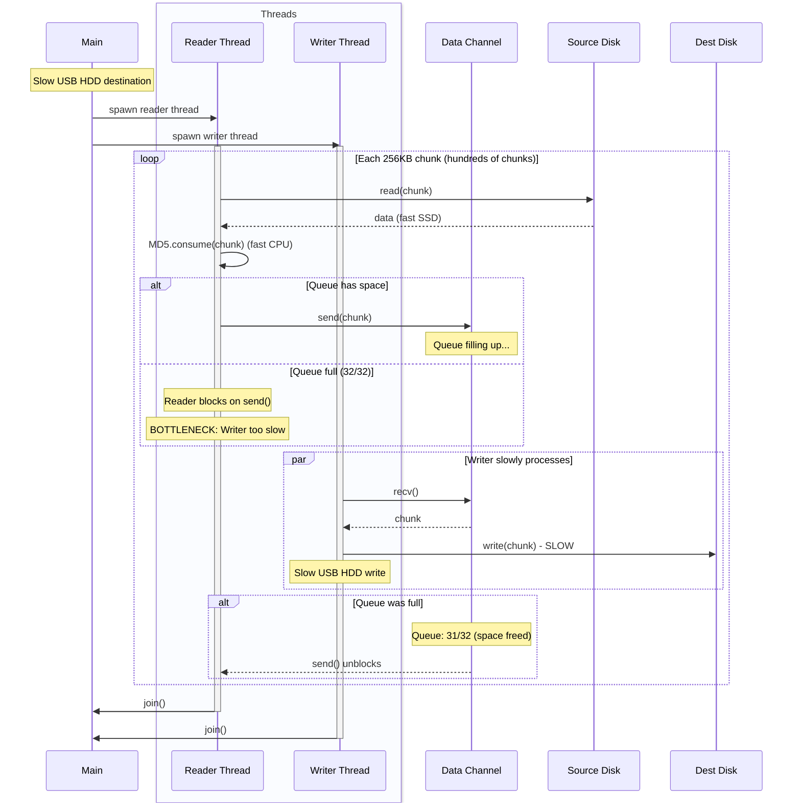
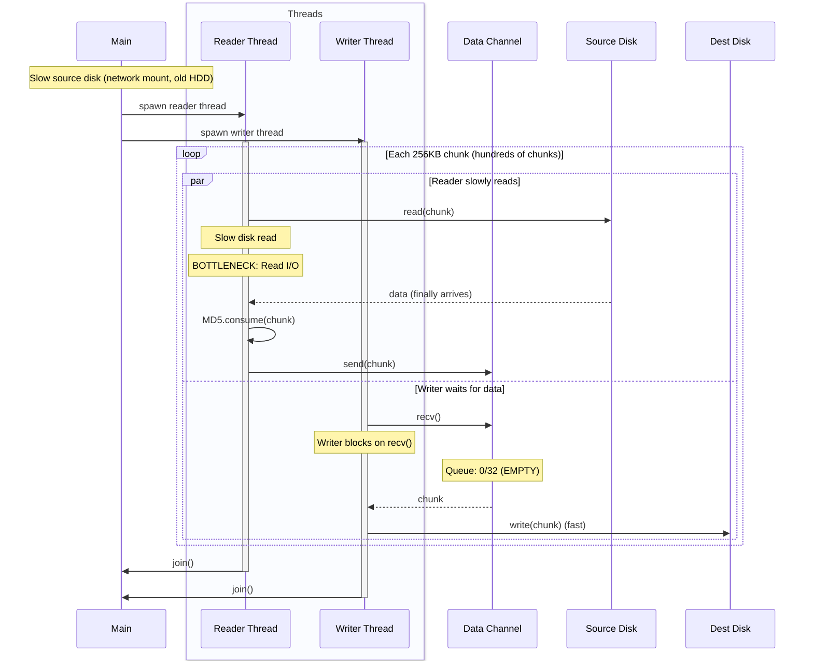
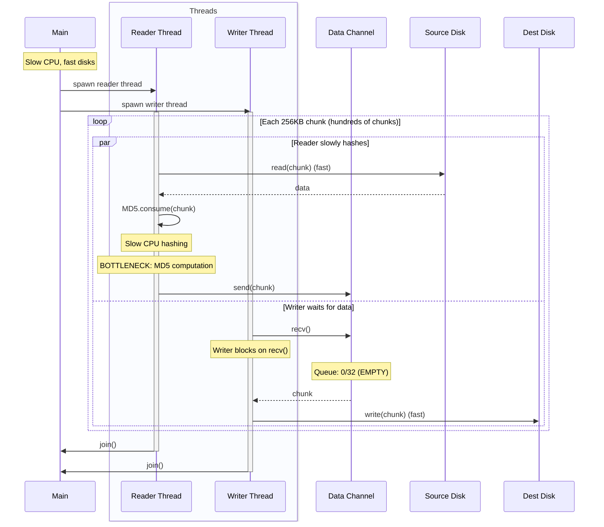

# ADR-0002: Pipeline Performance Instrumentation Strategy

## Status
Proposed

## Context

The backup system uses `stream_with_unified_pipeline` which orchestrates a 3-thread pipeline:
- **Reader thread**: Reads 256KB chunks + computes MD5 incrementally + sends via bounded channel (capacity 32)
- **Writer thread**: Receives chunks from channel + writes to destination
- **Monitor thread**: Compares final MD5 with previous backup for hardlinking decisions

### Pipeline Flow Over Time

#### Example 1: No previous file (first backup)



#### Example 2: Previous file doesn't match



#### Example 3: Previous file matches - hardlink created



#### Example 4: Memory throttle bottleneck



#### Example 5: Write I/O bottleneck (slow destination)



#### Example 6: Read I/O bottleneck (slow source)



#### Example 7: CPU/Hash bottleneck (slow MD5)



### Bottleneck Scenarios

**Scenario A: Write I/O Bound (slow USB HDD)**
- Reader spends most time blocked on `send()` (queue full)
- Writer constantly busy with `write()`
- Queue depth consistently 30-32/32

**Scenario B: CPU Bound (slow CPU, fast SSDs)**
- Reader spends most time in `MD5.consume()`
- Writer often blocked on `recv()` (queue empty)
- Queue depth consistently 0-2/32

**Scenario C: Read I/O Bound (slow source disk)**
- Reader spends most time in `read()`
- Writer often blocked on `recv()` (queue empty)
- Queue depth consistently 0-2/32

### Core Bottleneck Locations
1. **Reader I/O**: `file.read(&mut buffer)` - disk read performance
2. **Reader CPU**: `context.consume(&chunk)` - MD5 computation
3. **Reader blocking**: `data_tx.send(chunk)` - channel full, writer can't keep up
4. **Memory throttle**: Global 4GB limit causes reader to spin-wait
5. **Writer blocking**: Channel receive iterator - reader can't keep up
6. **Writer I/O**: `file.write_all(&chunk)` - disk write performance

Currently we see total bytes but not WHERE time is spent.

## Decision

Instrument the specific bottleneck points in `stream_with_unified_pipeline` to measure time spent in each operation.

### Implementation: Extend BackupStats

Add timing fields to `BackupStatsInner` (src/backup_sets/backup_stats.rs):

```rust
// Pipeline timing (nanoseconds)
reader_io_nanos: AtomicU64,           // Time in file.read()
reader_hash_nanos: AtomicU64,         // Time in MD5 context.consume()
reader_send_nanos: AtomicU64,         // Time blocked on data_tx.send()
writer_recv_nanos: AtomicU64,         // Time blocked on channel receive
writer_io_nanos: AtomicU64,           // Time in file.write_all()
memory_throttle_nanos: AtomicU64,     // Time spinning on memory limit
memory_throttle_count: AtomicU64,     // Number of throttle events
channel_max_depth: AtomicU64,         // Peak queue depth seen
```

### Instrumentation Points

**Reader Thread** (src/dhcopy/streaming_copy.rs, lines ~358-389):

```rust
// Around line 358 - Time pure I/O
let start = Instant::now();
let bytes_read = file.read(&mut buffer)?;
stats.add_reader_io_time(start.elapsed().as_nanos() as u64);

// Around line 371 - Time MD5 computation
let start = Instant::now();
context.consume(&chunk);
stats.add_reader_hash_time(start.elapsed().as_nanos() as u64);

// Around lines 374-383 - Time memory backpressure
let throttle_start = Instant::now();
while GLOBAL_MEMORY_USAGE.load(Ordering::Relaxed) > MAX_MEMORY_USAGE { ... }
stats.add_memory_throttle(throttle_start.elapsed().as_nanos() as u64);

// Around line 389 - Time channel send blocking
let start = Instant::now();
if data_tx.send(chunk).is_err() { break; }
stats.add_reader_send_time(start.elapsed().as_nanos() as u64);

// Every 10 chunks - Sample queue depth
if chunk_count % 10 == 0 {
    stats.update_max_channel_depth(data_tx.len() as u64);
}
```

**Writer Thread** (src/dhcopy/streaming_copy.rs, lines ~420-432):

```rust
// Time channel receive blocking
let recv_start = Instant::now();
for chunk in data_rx {
    stats.add_writer_recv_time(recv_start.elapsed().as_nanos() as u64);

    // Time pure write I/O
    let write_start = Instant::now();
    file.write_all(&chunk)?;
    stats.add_writer_io_time(write_start.elapsed().as_nanos() as u64);

    recv_start = Instant::now(); // Reset for next iteration
}
```

### Display During Backup

Show pipeline utilization every second:
```
[Reader] I/O: 45% | Hash: 35% | Send: 5% | Throttle: 0%
[Writer] Recv: 10% | I/O: 85%
[Queue] Depth: 28/32 | Memory: 1.2GB/4GB
[Rates] Read: 450 MB/s | Write: 89 MB/s
```

**Bottleneck immediately obvious:**
- Reader I/O + Hash = 80%, Writer I/O = 85% → **Both maxed, well balanced**
- Reader = 45%, Writer I/O = 95% → **Write I/O bound**
- Reader Hash = 85%, Writer = 20% → **CPU bound (MD5)**
- Queue always full (30/32) → **Writer can't keep up**
- Throttle events > 0 → **Memory backpressure**

### Single Benchmark

One benchmark calling real `backup()` function:

```rust
fn bench_mixed_workload() {
    // 50 × 1KB files + 5 × 10MB files
    let stats = backup(source, dest)?;

    // Raw metrics show bottleneck
    let total_ms = stats.elapsed.as_millis() as u64;
    println!("Reader I/O: {:.1}%", stats.reader_io_nanos / 1_000_000 * 100 / total_ms);
    println!("Reader hash: {:.1}%", stats.reader_hash_nanos / 1_000_000 * 100 / total_ms);
    println!("Writer I/O: {:.1}%", stats.writer_io_nanos / 1_000_000 * 100 / total_ms);
    println!("Peak queue: {}/32", stats.channel_max_depth);
    println!("Throttle events: {}", stats.memory_throttle_count);
}
```

## Consequences

### Positive
- Pinpoint exact bottleneck location in pipeline
- Uses real backup code, not synthetic tests
- Minimal overhead (just Instant::now() calls)
- Clear before/after comparison for changes

### Negative
- Requires instrumenting production code
- Timing adds small CPU overhead
- More complex than just total time

This gives precise visibility into pipeline performance without changing the core streaming architecture.
