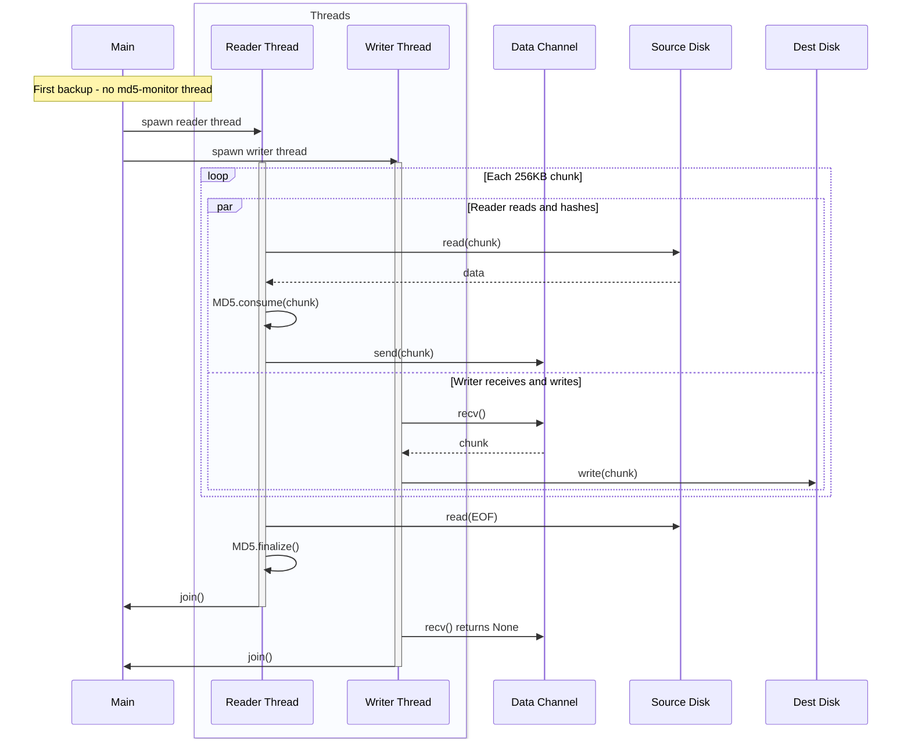
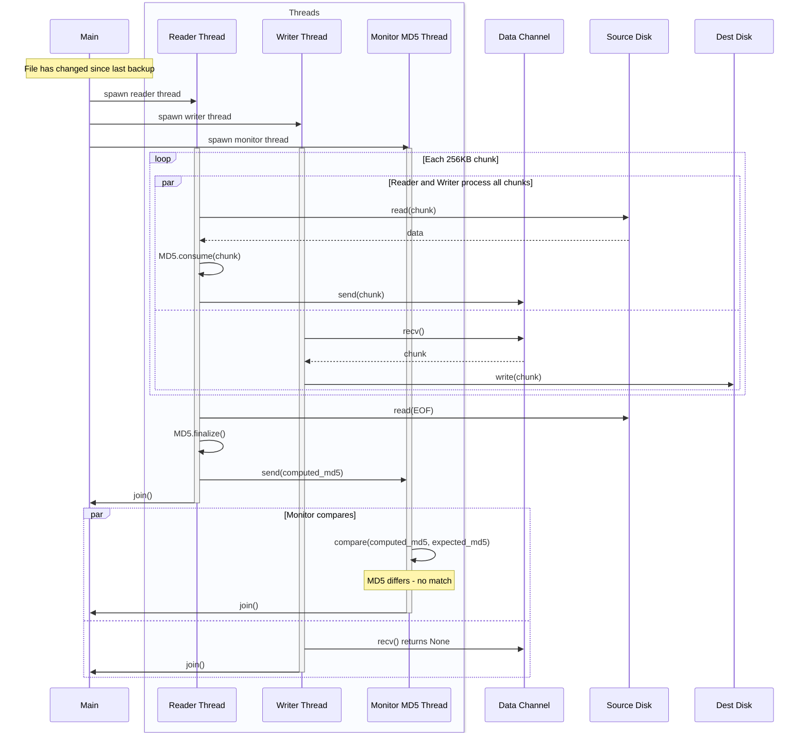
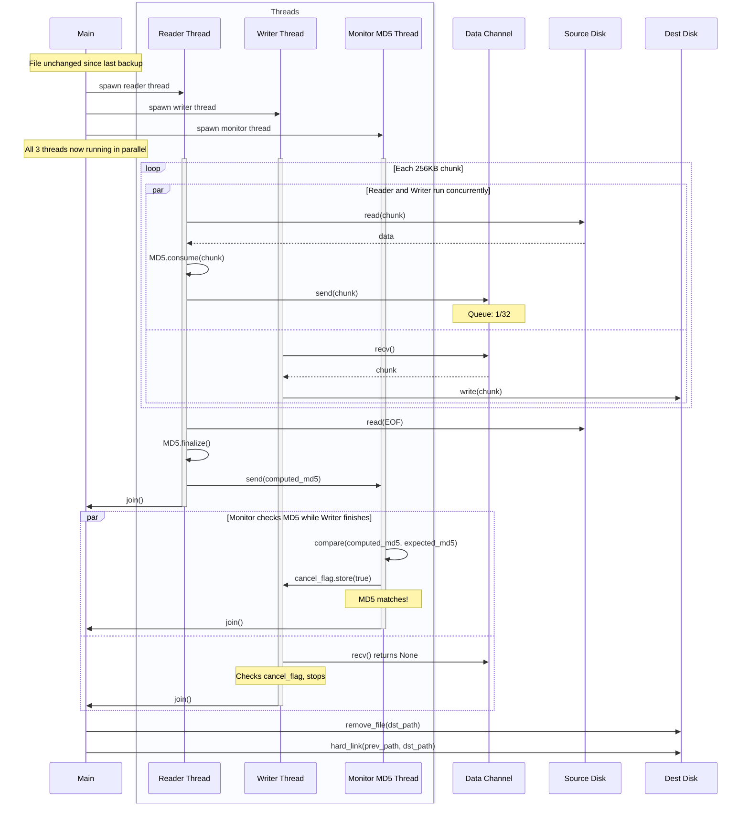
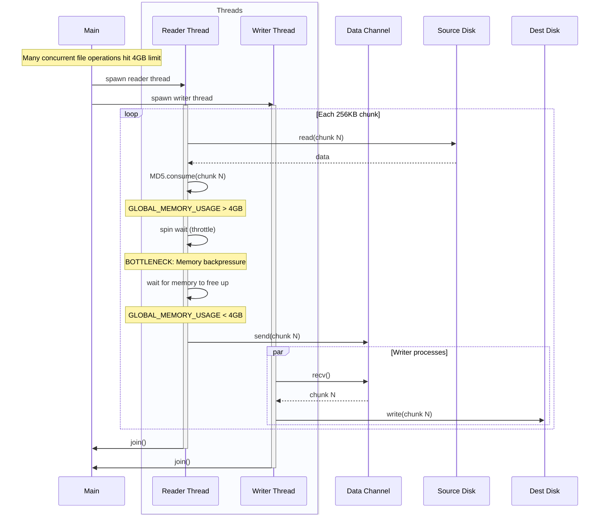
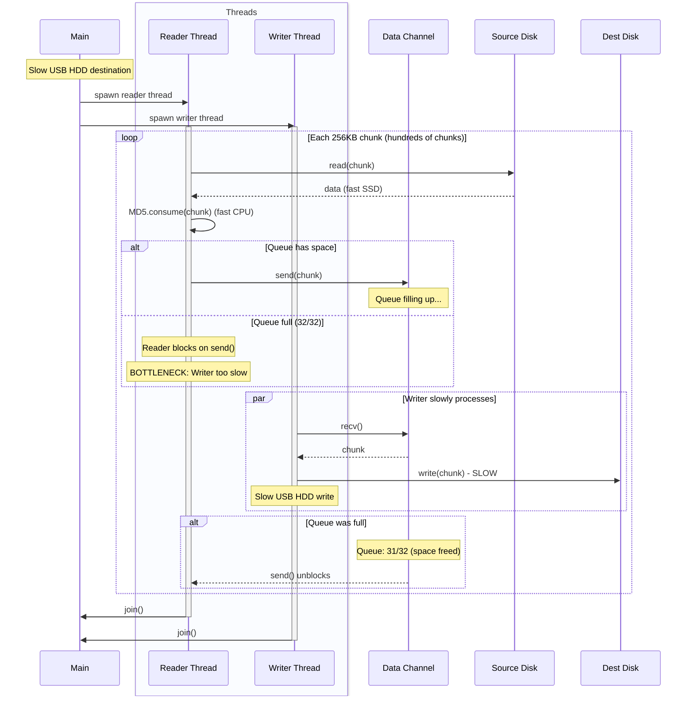
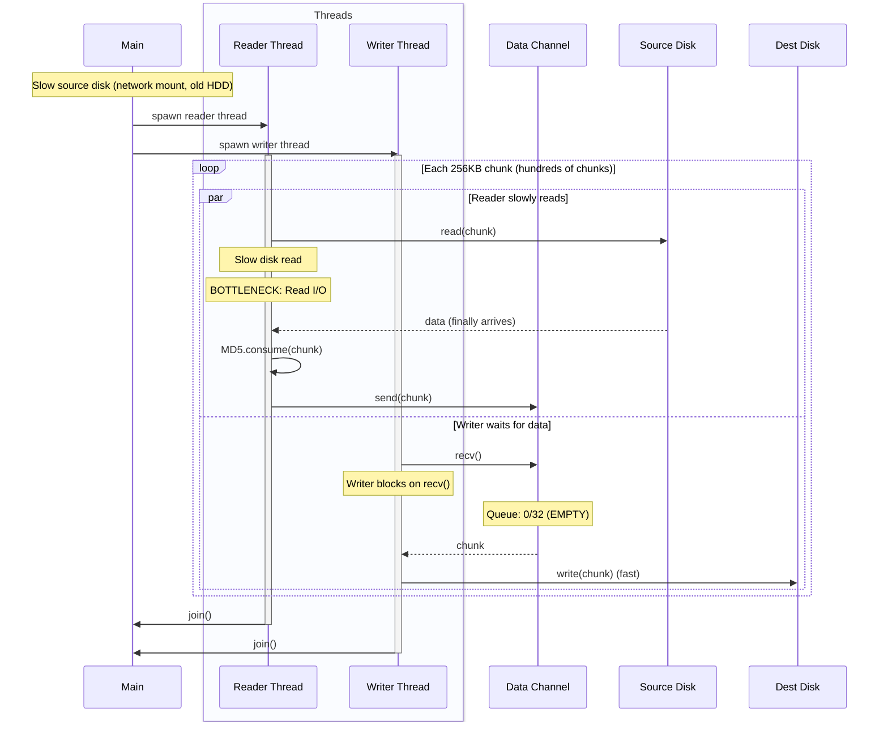
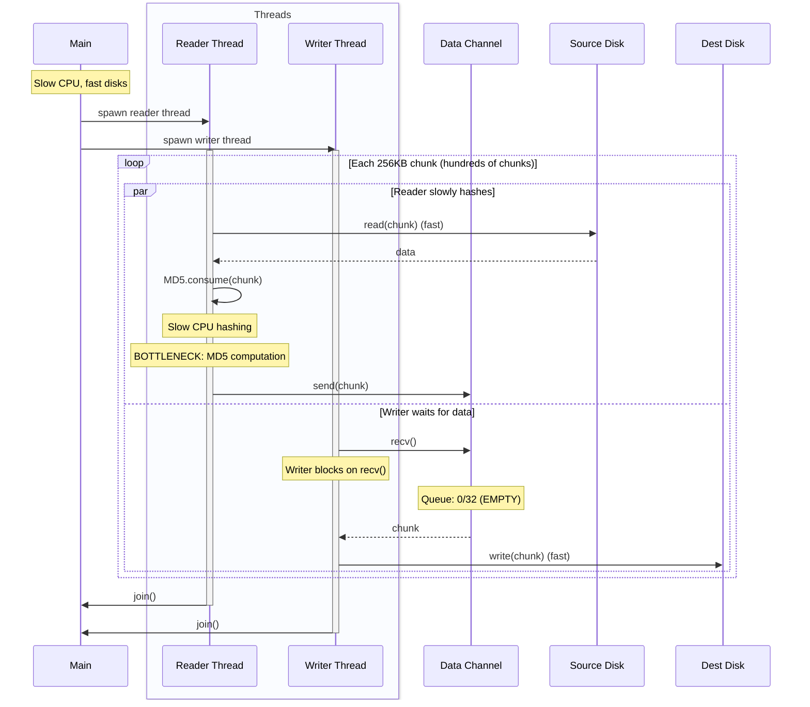

# ADR-0002: Runtime Pipeline Performance Telemetry

## Status
Proposed

## Context

The backup system uses `stream_with_unified_pipeline` which orchestrates a 3-thread pipeline:
- **Reader thread**: Reads 256KB chunks + computes MD5 incrementally + sends via bounded channel (capacity 32)
- **Writer thread**: Receives chunks from channel + writes to destination
- **Monitor thread**: Compares final MD5 with previous backup for hardlinking decisions

We need **runtime visibility** into pipeline behavior during actual backups to identify bottlenecks and measure impact of architectural changes. Traditional benchmarks are insufficient - we need to watch real backups and see where threads spend their time.

### Pipeline Flow Over Time

#### Example 1: No previous file (first backup)



#### Example 2: Previous file doesn't match



#### Example 3: Previous file matches - hardlink created



#### Example 4: Memory throttle bottleneck



#### Example 5: Write I/O bottleneck (slow destination)



#### Example 6: Read I/O bottleneck (slow source)



#### Example 7: CPU/Hash bottleneck (slow MD5)



### Bottleneck Scenarios

**Scenario A: Write I/O Bound (slow USB HDD)**
- Reader spends most time blocked on `send()` (queue full)
- Writer constantly busy with `write()`
- Queue depth consistently 30-32/32

**Scenario B: CPU Bound (slow CPU, fast SSDs)**
- Reader spends most time in `MD5.consume()`
- Writer often blocked on `recv()` (queue empty)
- Queue depth consistently 0-2/32

**Scenario C: Read I/O Bound (slow source disk)**
- Reader spends most time in `read()`
- Writer often blocked on `recv()` (queue empty)
- Queue depth consistently 0-2/32

### Core Bottleneck Locations
1. **Reader I/O**: `file.read(&mut buffer)` - disk read performance
2. **Reader CPU**: `context.consume(&chunk)` - MD5 computation
3. **Reader blocking**: `data_tx.send(chunk)` - channel full, writer can't keep up
4. **Memory throttle**: Global 4GB limit causes reader to spin-wait
5. **Writer blocking**: Channel receive iterator - reader can't keep up
6. **Writer I/O**: `file.write_all(&chunk)` - disk write performance

Currently we see total bytes but not WHERE time is spent or WHERE threads are blocked.

## Decision

Add **runtime telemetry** to the pipeline by sampling queue depth periodically and tracking time in each operation. Display stats in real-time during backups and summarize at completion.

### Why Not Simple Timers?

Wrapping `send()` or `recv()` in `Instant::now()` timers **does work** - it tells us how long we were blocked. But we can do better:

**Combined approach:**
1. **Time each operation** (read, hash, send, recv, write) - shows absolute time spent
2. **Sample queue depth** - shows backpressure direction (full = writer slow, empty = reader slow)
3. **Count memory throttle events** - shows if 4GB limit is being hit

This gives both:
- **Absolute metrics**: "Reader spent 45s in I/O, 30s in hashing, 5s blocked on send"
- **Relative metrics**: "Reader I/O = 45%, Hash = 30%, Blocked = 5%" (as % of total time)
- **Queue metrics**: "Queue averaged 28/32 (90% full) → Writer is bottleneck"

### Implementation: Extend BackupStats

Add to `BackupStatsInner` (src/backup_sets/backup_stats.rs):

```rust
// Pipeline timing (nanoseconds) - cumulative across all files
reader_io_nanos: AtomicU64,           // Time in file.read()
reader_hash_nanos: AtomicU64,         // Time in MD5 context.consume()
reader_send_nanos: AtomicU64,         // Time blocked on data_tx.send()
writer_recv_nanos: AtomicU64,         // Time blocked on channel receive
writer_io_nanos: AtomicU64,           // Time in file.write_all()
memory_throttle_nanos: AtomicU64,     // Time spinning on memory limit
memory_throttle_count: AtomicU64,     // Number of throttle events

// Queue depth sampling
queue_depth_samples: AtomicU64,       // Number of samples taken
queue_depth_sum: AtomicU64,           // Sum of all samples (for average)
queue_depth_max: AtomicU64,           // Peak depth seen
```

### Instrumentation Points

**Reader Thread** (src/dhcopy/streaming_copy.rs, reader_thread function):

```rust
loop {
    // 1. Time read I/O
    let start = Instant::now();
    let bytes_read = file.read(&mut buffer)?;
    stats.add_reader_io_time(start.elapsed().as_nanos() as u64);

    if bytes_read == 0 { break; }

    let chunk = buffer[..bytes_read].to_vec();

    // 2. Time MD5 hashing
    let start = Instant::now();
    context.consume(&chunk);
    stats.add_reader_hash_time(start.elapsed().as_nanos() as u64);

    // 3. Time memory throttle (if any)
    let throttle_start = Instant::now();
    while global_memory.load(Ordering::Relaxed) + bytes_read > GLOBAL_MAX_BUFFER {
        thread::sleep(Duration::from_millis(10));
        if cancel_flag.load(Ordering::SeqCst) { /* ... */ }
    }
    let throttle_time = throttle_start.elapsed().as_nanos() as u64;
    if throttle_time > 0 {
        stats.add_memory_throttle_time(throttle_time);
        stats.inc_memory_throttle_count();
    }

    global_memory.fetch_add(bytes_read, Ordering::SeqCst);

    // 4. Sample queue depth before send
    stats.sample_queue_depth(data_tx.len() as u64);

    // 5. Time send blocking
    let start = Instant::now();
    if data_tx.send(chunk).is_err() { /* ... */ }
    stats.add_reader_send_time(start.elapsed().as_nanos() as u64);
}
```

**Writer Thread** (src/dhcopy/streaming_copy.rs, writer_thread function):

```rust
let mut recv_start = Instant::now();

for chunk in data_rx {
    // 1. Time blocked on receive
    stats.add_writer_recv_time(recv_start.elapsed().as_nanos() as u64);

    if cancel_flag.load(Ordering::SeqCst) { /* ... */ }

    // 2. Time write I/O
    let start = Instant::now();
    file.write_all(&chunk)?;
    stats.add_writer_io_time(start.elapsed().as_nanos() as u64);

    stats.add_target_written(chunk.len() as u64);
    global_memory.fetch_sub(chunk.len(), Ordering::SeqCst);

    recv_start = Instant::now(); // Reset for next iteration
}
```

### Real-Time Display

Print stats every second during backup:

```
=== Pipeline Stats (last 1s) ===
[Reader] I/O: 45% | Hash: 30% | Blocked: 5% | Throttle: 0%
[Writer] Blocked: 10% | I/O: 85%
[Queue]  Avg: 28/32 (88%) | Peak: 32/32 | Now: 27/32
[Memory] Usage: 1.2GB/4GB (30%)
[Rates]  Read: 450 MB/s | Write: 89 MB/s | Hash: 450 MB/s
```

**Calculations:**
- Percentages = `(operation_nanos / total_elapsed_nanos) * 100`
- Queue average = `queue_depth_sum / queue_depth_samples`
- Rates = `bytes / elapsed_seconds`

### Final Summary

After backup completes, show total breakdown:

```
=== Final Pipeline Stats ===
Total time: 2m 15s (135s)

Reader Thread:
  I/O:      60.5s (45%)  ████████████████████
  Hash:     40.5s (30%)  █████████████
  Blocked:   6.8s (5%)   ██
  Throttle:  0.0s (0%)

Writer Thread:
  Blocked:  13.5s (10%)  ████
  I/O:     114.8s (85%)  █████████████████████████████████████

Queue Stats:
  Average depth: 28/32 (88% full)
  Peak depth:    32/32 (100% full)
  → BOTTLENECK: Writer I/O (queue constantly full)

Memory:
  Peak usage: 3.2GB/4GB (80%)
  Throttle events: 0
```

### Interpreting Results

**Write I/O Bottleneck** (Example 5):
- Writer I/O: 85%+ of time
- Reader Blocked: 5%+ of time (waiting to send)
- Queue: 28-32/32 (constantly full)
→ **Destination disk is slow. Consider faster disk or compression.**

**Read I/O Bottleneck** (Example 6):
- Reader I/O: 80%+ of time
- Writer Blocked: 40%+ of time (waiting to recv)
- Queue: 0-2/32 (constantly empty)
→ **Source disk is slow. Consider caching or different filesystem.**

**CPU Bottleneck** (Example 7):
- Reader Hash: 70%+ of time
- Writer Blocked: 40%+ of time (waiting to recv)
- Queue: 0-2/32 (constantly empty)
→ **MD5 computation is slow. Consider faster hash (xxhash) or hardware acceleration.**

**Memory Bottleneck** (Example 4):
- Reader Throttle: 20%+ of time
- Throttle events: 100+
→ **4GB limit is too low. Increase MAX_MEMORY_USAGE or reduce concurrency.**

**Balanced Pipeline** (ideal):
- Reader I/O + Hash ≈ 80-90%
- Writer I/O ≈ 80-90%
- Queue: 10-20/32 (moderate buffering)
- All Blocked times < 10%
→ **System is well-tuned. Both threads working efficiently.**

## Consequences

### Positive
- **Real-time visibility**: See bottlenecks while backup is running
- **Real backups**: Watch actual usage, not synthetic benchmarks
- **Clear diagnosis**: Metrics directly show which component is maxed out
- **Architectural decisions**: Know which optimizations will help (e.g., faster disk vs faster hash vs more memory)
- **Before/after comparison**: Change code, run backup, see if stats improved
- **Minimal overhead**: `Instant::now()` calls + a few atomic increments per chunk

### Negative
- **Production instrumentation**: Adds timing code to hot paths
- **Small CPU overhead**: ~1-2% for timing operations (acceptable tradeoff for visibility)
- **Display complexity**: Need to format and print stats periodically

### Alternatives Considered

**Synthetic benchmarks**: Rejected - don't test real backup code, don't show bottlenecks in actual usage

**External profiling tools**: Rejected - can't see queue depth, memory throttles, or distinguish read I/O from hash CPU time within reader thread

**No instrumentation**: Rejected - leaves us blind to bottlenecks, can't make informed architectural decisions

This approach gives runtime visibility into pipeline behavior during real backups, enabling data-driven optimization decisions.
