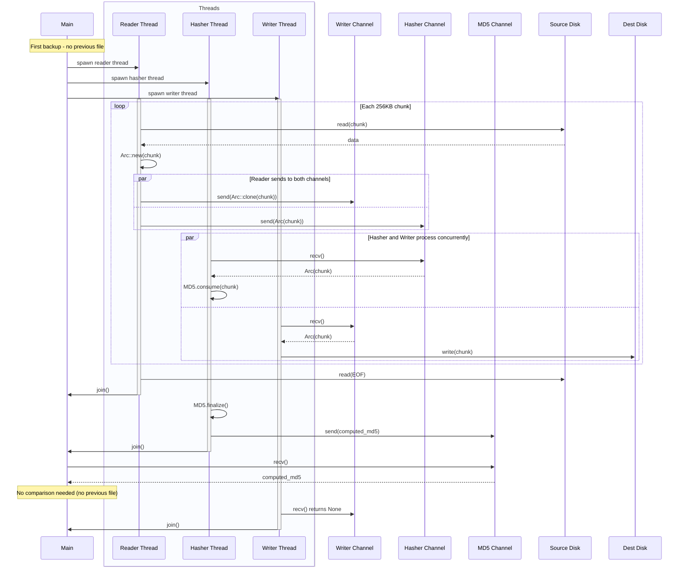
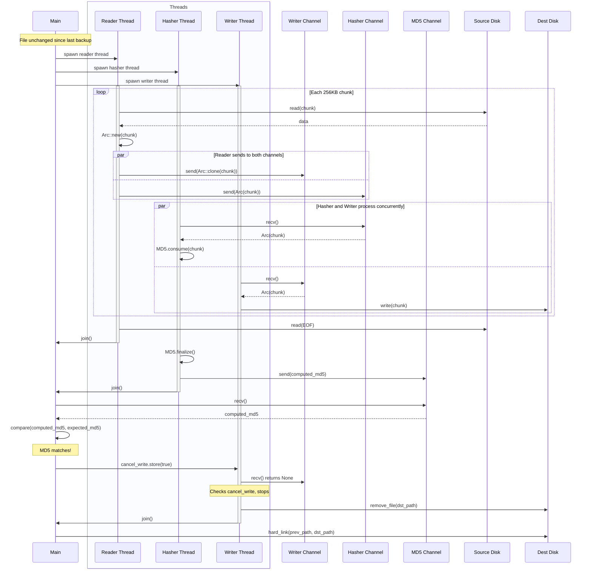
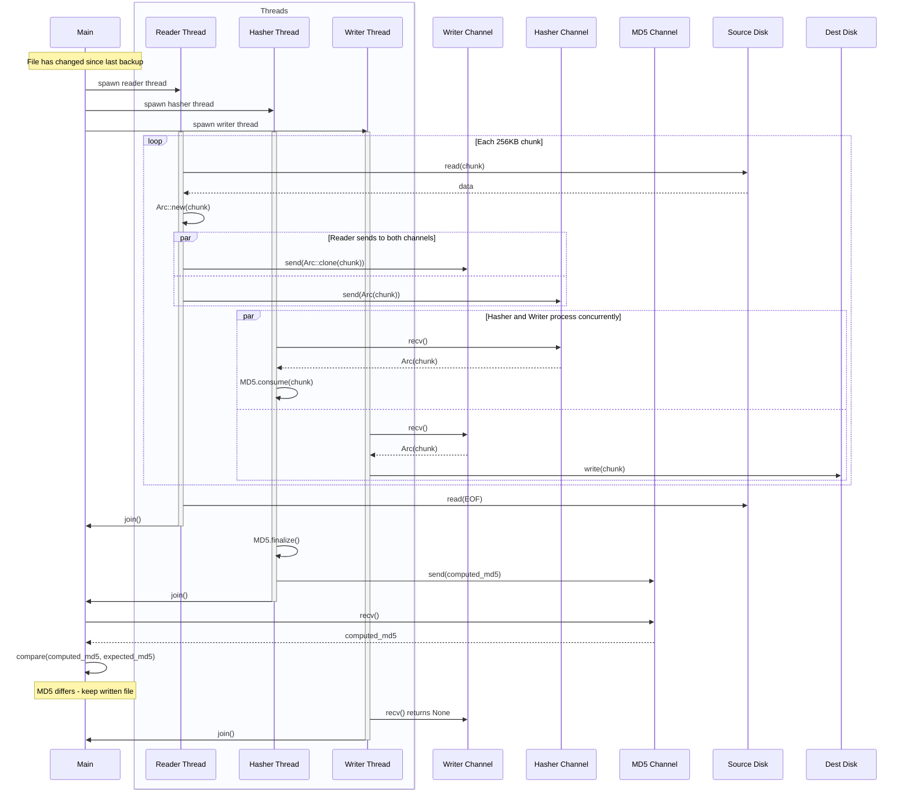
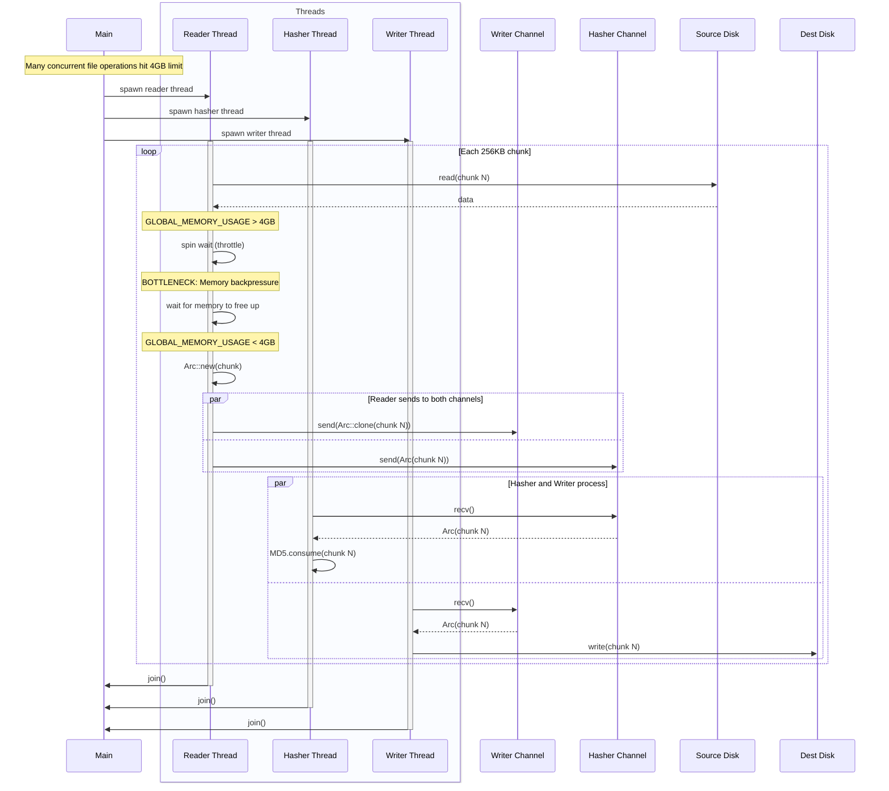
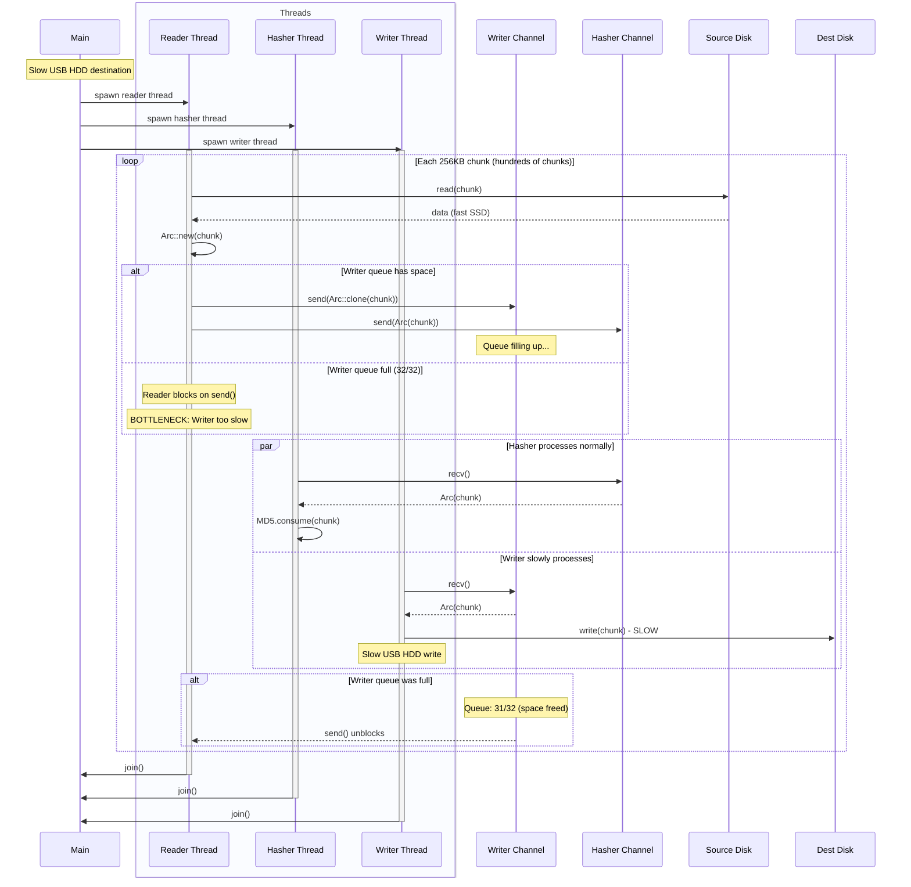
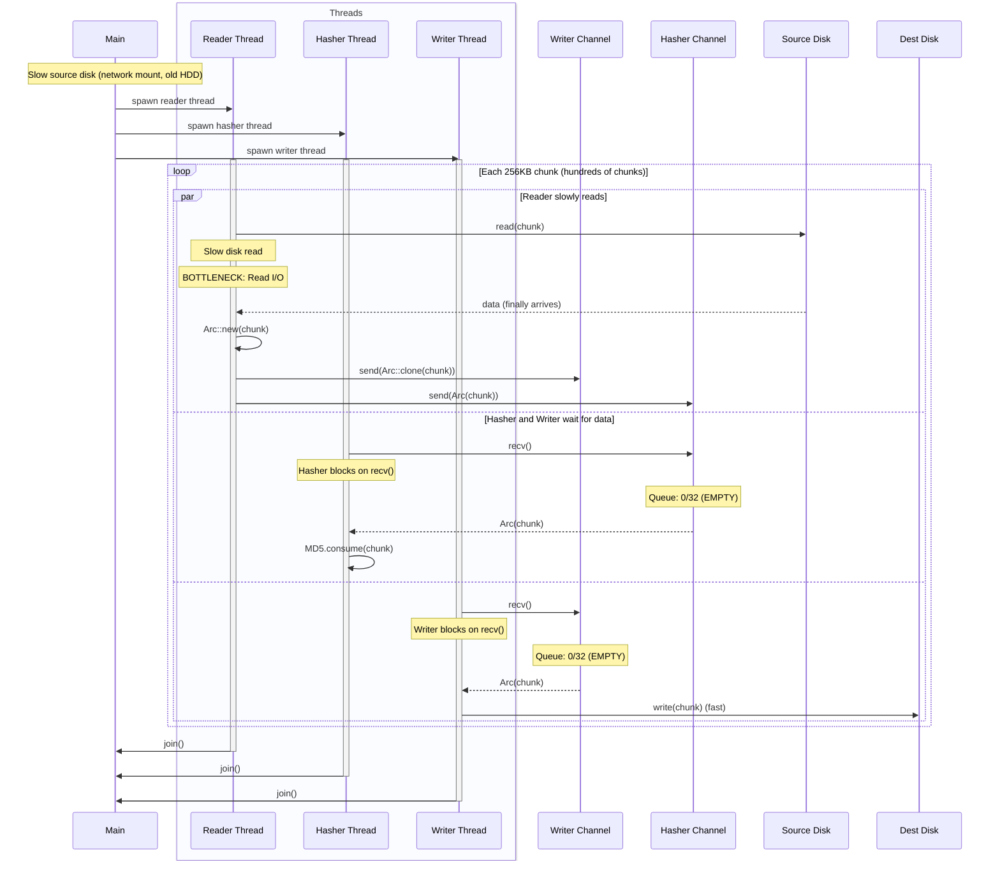
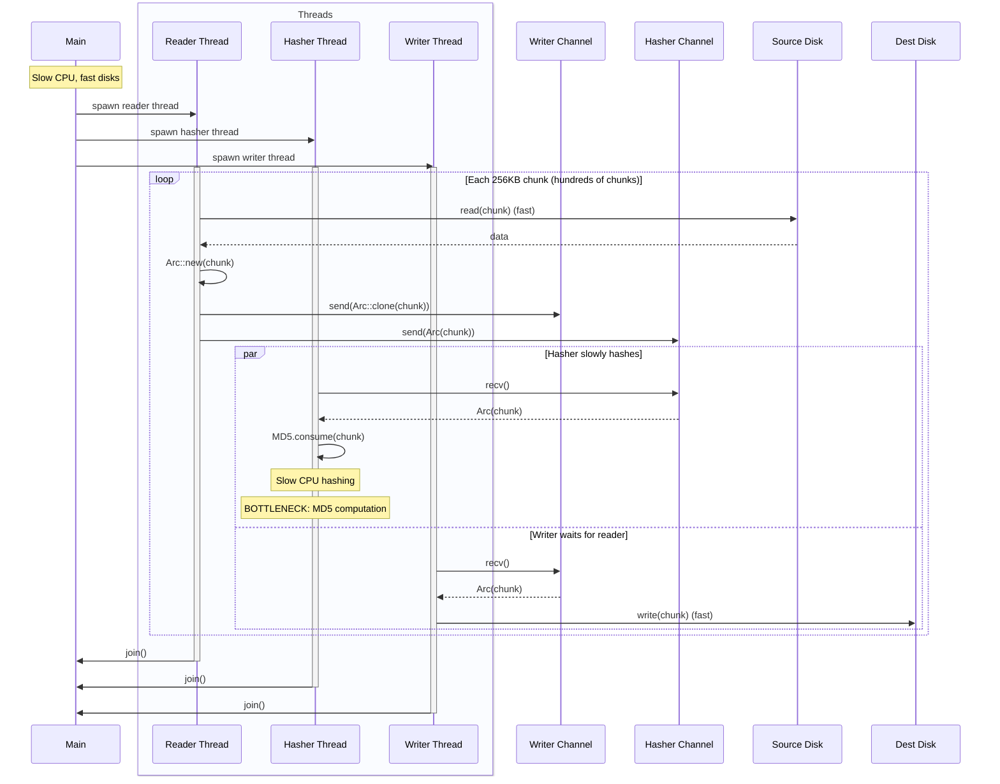

# Threading Architecture

Disk Hog Backup uses a multi-threaded pipeline architecture to maximize throughput when backing up files. This document describes the current threading model as of commit [9d33dbb](https://github.com/timabell/disk-hog-backup/commit/9d33dbbe4e044b9c86910b161986614db8f84059).

## Overview

The backup pipeline uses **four threads** per file operation:

1. **Main thread**: Orchestrates the pipeline, compares MD5 hashes, makes hardlink decisions
2. **Reader thread**: Reads 256KB chunks from source disk
3. **Hasher thread**: Computes MD5 incrementally on chunks
4. **Writer thread**: Writes chunks to destination disk

Data flows through **crossbeam bounded channels**:
- Reader sends `Arc<Vec<u8>>` chunks to both writer and hasher (shared via Arc, no data duplication)
- Hasher sends final MD5 hash to main thread
- Main thread decides whether to cancel write and create hardlink

## Key Parameters

From `src/dhcopy/streaming_copy.rs`:

```rust
const CHUNK_SIZE: usize = 256 * 1024; // 256KB per chunk
const MAX_QUEUE_CHUNKS: usize = 32;   // Limit read-ahead to 32 chunks per file
const GLOBAL_MAX_BUFFER: usize = 4 * 1024 * 1024 * 1024; // 4GB across all files
```

## Threading Flow Scenarios

### Scenario 1: No previous file (first backup)



### Scenario 2: File unchanged - hardlink created



### Scenario 3: File changed - copy written



### Scenario 4: Memory throttle bottleneck



### Scenario 5: Write I/O bottleneck (slow destination)



### Scenario 6: Read I/O bottleneck (slow source)



### Scenario 7: CPU/Hash bottleneck (slow MD5)



## Optimization: mtime Shortcut

Before entering the full pipeline, the code checks if the file size and modification time (mtime) match the previous backup. If both match, it immediately creates a hardlink without reading the file or computing MD5. This optimization is documented in [issue #58](https://github.com/timabell/disk-hog-backup/issues/58).

From `src/dhcopy/streaming_copy.rs:369-382`:

```rust
// Optimization: If mtime and size match, trust that file is unchanged and skip MD5
if let Some(prev) = previous_file
    && let Some(prev_p) = prev_path
{
    let src_metadata = src_path.metadata()?;
    let prev_metadata = prev_p.metadata()?;

    // Check if size matches
    if src_metadata.len() == prev_metadata.len() {
        // Size matches, check mtime
        if files_match_by_mtime(&src_metadata, &prev_metadata) {
            // Trust the timestamp - skip MD5 check and hardlink immediately
            create_hardlink(prev_p, dst_path)?;
            return Ok((true, prev.md5));
        }
    }
}
```

## Performance Telemetry

The system tracks detailed timing metrics for each pipeline stage (see [ADR-0002](adr/0002-performance-benchmarking-strategy.md)):

**Reader thread** (from `src/dhcopy/streaming_copy.rs:494-562`):
- I/O time: `add_reader_io_time()`
- Memory throttle time: `add_memory_throttle_time()`
- Writer send time: `add_reader_send_writer_time()`
- Hasher send time: `add_reader_send_hasher_time()`
- Queue depth samples: `sample_writer_queue_depth()`, `sample_hasher_queue_depth()`

**Hasher thread** (from `src/dhcopy/streaming_copy.rs:564-597`):
- Receive time: `add_hasher_recv_time()`
- Hash computation time: `add_hasher_hash_time()`

**Writer thread** (from `src/dhcopy/streaming_copy.rs:599-642`):
- Receive time: `add_writer_recv_time()`
- I/O time: `add_writer_io_time()`

These metrics help identify bottlenecks during real backup operations.

## Design Benefits

1. **Clean separation of concerns**: Each thread has a single responsibility
2. **Zero-copy data sharing**: `Arc<Vec<u8>>` allows both hasher and writer to access the same data without duplication
3. **Parallel processing**: Hashing and writing happen concurrently
4. **Early termination**: Writer can be cancelled mid-stream if MD5 matches
5. **Backpressure handling**: Bounded channels (32 chunks) prevent unbounded memory growth
6. **Global memory limit**: 4GB cap across all concurrent file operations prevents OOM
7. **Detailed telemetry**: Runtime metrics show where bottlenecks occur

## See Also

- [ADR-0001: Streaming Copy and MD5](adr/0001-streaming-copy-and-md5.md) - Original design and evolution
- [ADR-0002: Performance Benchmarking Strategy](adr/0002-performance-benchmarking-strategy.md) - Telemetry and bottleneck detection
- [Issue #49](https://github.com/timabell/disk-hog-backup/issues/49) - Original streaming pipeline implementation
- [Issue #61](https://github.com/timabell/disk-hog-backup/issues/61) - Separate hasher thread
- [Issue #65](https://github.com/timabell/disk-hog-backup/issues/65) - Move MD5 comparison to main thread
